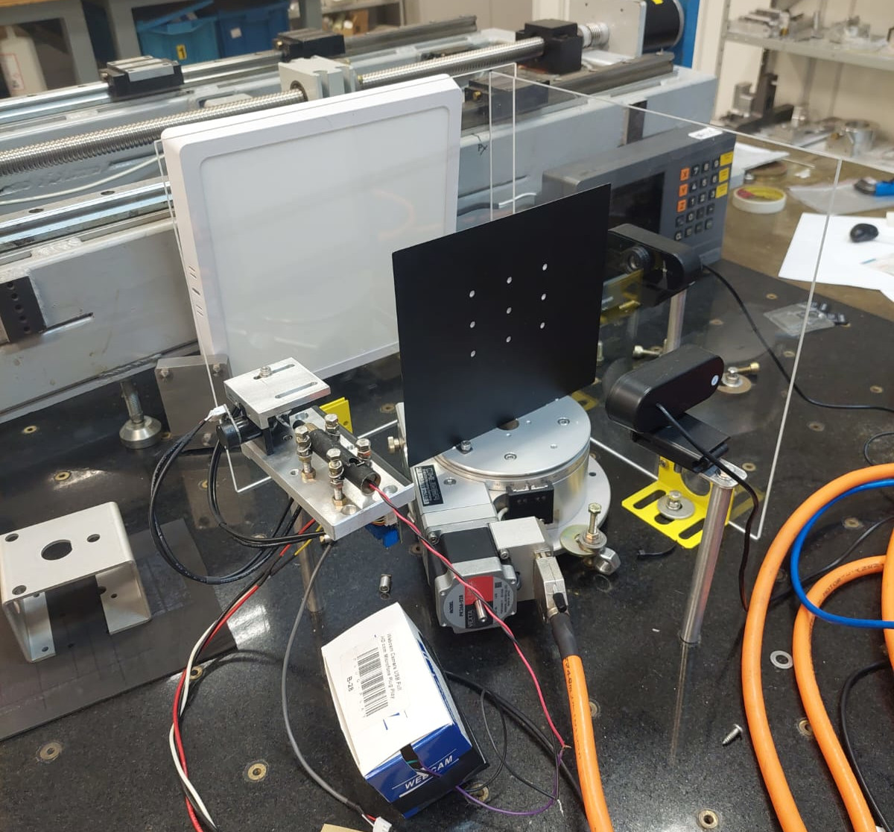
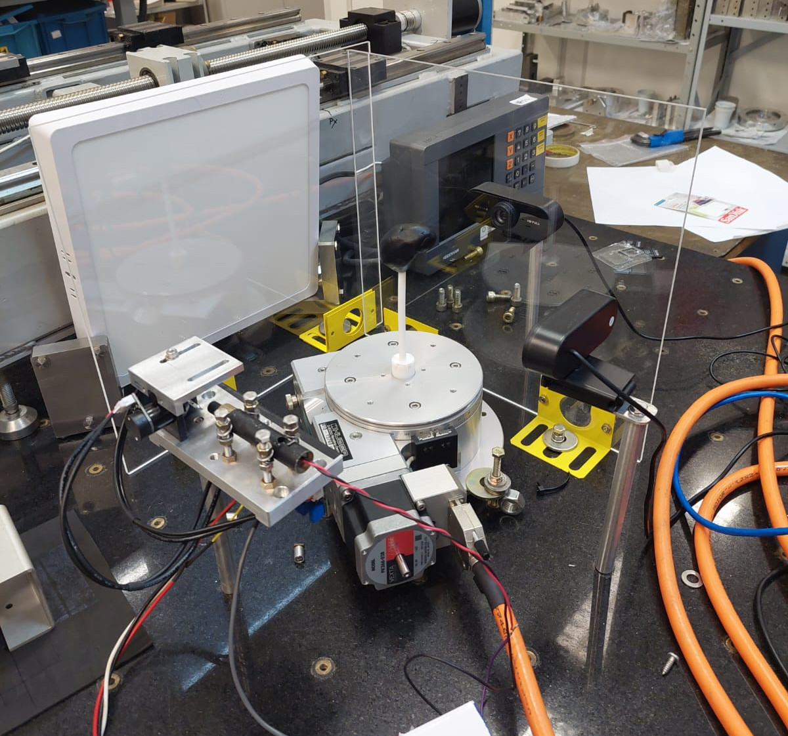
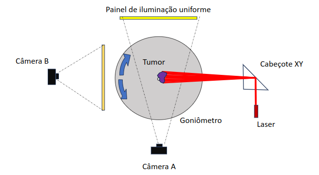
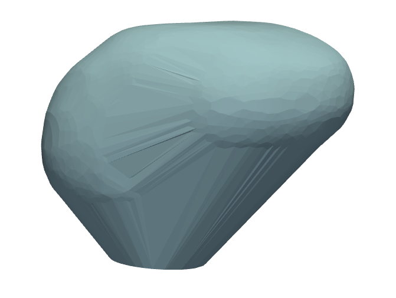
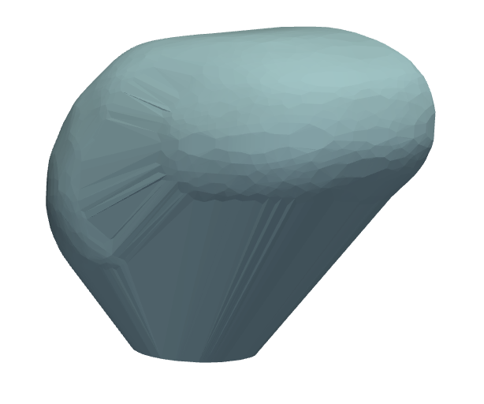
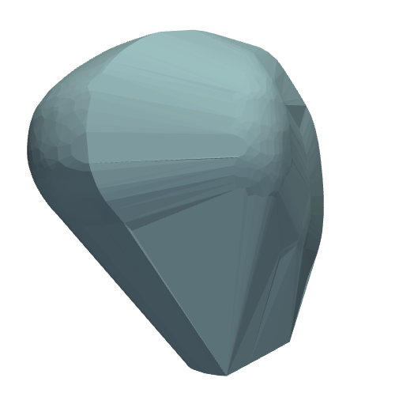
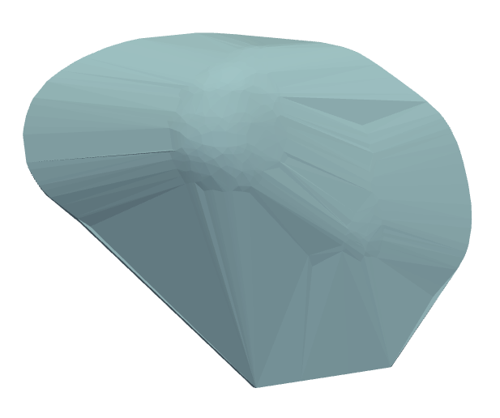

# Proton Beam Therapy Simulator

## Table of Contents
1. [Project Overview](#project-overview)
   - [Context](#context)
   - [Physical Implementation](#physical-implementation)
   - [System Architecture](#system-architecture)
   - [Implementation Details](#implementation-details)
     * [Calibration Process](#1-calibration-process)
     * [Tomographic Imaging](#2-tomographic-imaging)
     * [Irradiation Process](#3-irradiation-process)
   - [Results](#results)

2. [Technical Documentation](#technical-documentation)
   - [Software Architecture](#software-architecture)
     * [Calibration Modules](#calibration-modules)
     * [Auxiliary Modules](#auxiliary-modules)
     * [Core Processing Modules](#core-processing-modules)
     * [Execution Modules](#execution-modules)
   - [Usage Instructions](#usage-instructions)
     * [System Setup](#system-setup)
     * [Running the Simulation](#running-the-simulation)
     * [Configuration](#configuration)
   - [Key Dependencies](#key-dependencies)
   - [Development Notes](#development-notes)
   - [Contributing](#contributing)
   - [License](#license)

## Project Overview

### Context
Proton beam therapy represents a promising frontier in oncological treatment, offering advantages over conventional radiotherapy modalities. The ability of protons to deposit most of their energy at the Bragg peak allows for concentrated radiation dose delivery to tumors while minimizing exposure to surrounding healthy tissues. This characteristic is particularly advantageous for tumors located near vital organs and in pediatric treatments.

However, widespread adoption of proton therapy faces technical and economic challenges, including high infrastructure costs and the need for extreme precision in beam targeting. This project addresses these challenges through an innovative approach of rotating the patient instead of the beam, potentially reducing operational costs and increasing treatment accessibility.

### Physical Implementation
Below are images of the actual device implementation:

<table>
<tr>
<td></td>
<td></td>
</tr>
<tr>
<td align="center"><em>Device setup with calibration plate</em></td>
<td align="center"><em>Device setup with tumor model</em></td>
</tr>
</table>

The device consists of a goniometer placed between two cameras, with a laser system controlled by mirrors for beam targeting. The setup allows for precise calibration and tumor targeting through controlled rotations and beam positioning.

### System Architecture



The simulator consists of several key components:

- **Goniometer**: Simulates patient chair rotation, positioned between two cameras
- **Cameras**: 
  - Camera A: Acts as a tomograph, capturing tumor images at various angles
  - Camera B: Handles laser calibration and position verification
- **Laser System**:
  - Controlled via MCP board
  - Directed by two mirrors (X and Y axes)
  - Powered by FAST-PS sources
- **Control Software**: Manages calibration, imaging, and beam targeting

### Implementation Details

#### 1. Calibration Process
The calibration involves multiple steps:
- Alignment of calibration plate with Camera A
- 89-degree rotation for laser calibration
- Manual and fine-tuned laser positioning
- Centroid detection for precise targeting

#### 2. Tomographic Imaging
- Captures 360 tumor images at 1-degree intervals
- Generates 3D tumor model from silhouettes
- Converts pixel coordinates to cylindrical coordinates for processing

   

*Different views of the generated 3D tumor model*

#### 3. Irradiation Process
- Establishes voltage-to-pixel correspondence through linear interpolation
- Segments tumor model into slices for depth simulation
- Rotates coordinate system to match physical tumor position
- Controls laser targeting based on transformed coordinates

### Results

The project achieved its primary objectives:
1. Successfully developed robust software for proton irradiation simulation
2. Implemented precise calibration modules
3. Created accurate 3D tumor modeling
4. Demonstrated effective beam targeting across multiple angles and depths

Areas identified for future improvement include:
- Enhanced calibration precision
- Refined depth simulation techniques
- Improved voltage parameter interpolation methods

## Technical Documentation

### Software Architecture

The system comprises 12 core modules:

#### Calibration Modules
1. **Goniometer.py**
   - Manages goniometer movement and communication
   - Handles serial communication and angle positioning
   - Integrates with imaging system for tomography

2. **Painter.py**
   - Controls laser movement and calibration
   - Manages beam targeting and tumor irradiation
   - Implements calibration routines

3. **Image_processor.py**
   - Processes captured images
   - Detects contours and centroids
   - Handles tumor identification

#### Auxiliary Modules
4. **Socket_connection.py**
   - Manages network communications
   - Handles device connectivity

5. **Laser.py**
   - Controls laser operation via MCP2210
   - Manages beam activation timing

6. **Camera.py**
   - Interfaces with imaging devices
   - Handles image capture and storage

7. **Mcp.py**
   - Configures USB-to-SPI bridge
   - Manages hardware communication

#### Core Processing Modules
8. **Model_generator.py**
   - Converts 2D silhouettes to 3D models
   - Handles coordinate transformations

9. **Tumour.py**
   - Represents tumor in 3D space
   - Manages rotations and transformations

#### Execution Modules
10. **Run.py**
    - Main execution orchestrator
    - Manages simulation workflow

11. **Function_chain.py**
    - Implements linked list of execution functions
    - Controls program flow

### Usage Instructions

1. **System Setup**
```bash
# Clone the repository
git clone https://github.com/andre-meneses/simulador-cnpem

# Install dependencies (ensure Python 3.x is installed)
pip install -r requirements.txt
```

2. **Running the Simulation**
```bash
python3 Run.py <argument>
```
Available arguments:
- `calibrate`: Start from calibration phase
- `tomography`: Begin with tomographic imaging
- `generate-model`: Start from model generation
- `burn-tumour`: Execute only tumor irradiation

3. **Configuration**
- Modify `config/config.yaml` for system parameters
- Adjust calibration settings in respective modules

### Key Dependencies
- OpenCV: Image processing
- NumPy: Numerical computations
- PyVista: 3D visualization
- Matplotlib: Data visualization
- scikit-learn: Data analysis

### Development Notes
- Follow modular design principles
- Maintain separation of concerns
- Document new features and changes
- Test thoroughly before integration
